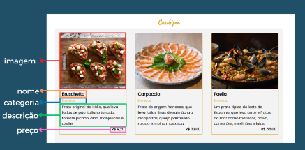
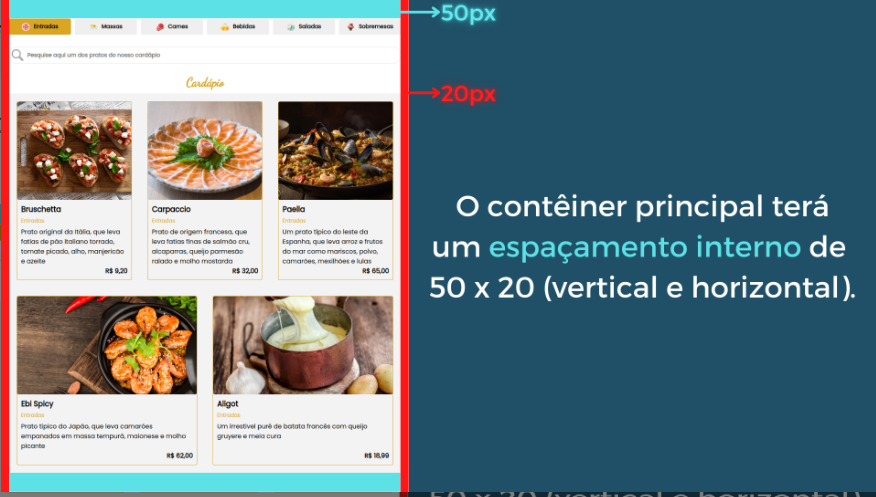

1 - O App deve carregar pratos do restaurante com imagem, nome, categoria, descrição e preço

2- Os dados da aplicação devem ser estáticos e armazenados localmente

3- A aplicação deve ser iniciada mostrando os pratos da categoria "entrada"

4- A aplicação deve permitir ao usuário filtrar os pratos através dos botões de categoria

5- Sempre que um botão for clicado, ele deve "acender", ou seja, ele deve mudar de cor como indicação de que foi clicado pelo usuário

6- A aplicação deve permitir a busca por pratos quando um usuário digitar o nome ou a descrição de um prato no campo de busca

7- A busca deve ocorrer a partir do 3° caractere digitado, deve aceitar textos parciais e também deve ignorar letras minúsculas ou maiúsculas no resultado
Exemplo: Uma busca por "sa", tem menos de três caracteres e não executa nada na página.

Exemplo: Buscar por "Sal" deve retornar resultados que contenham a palavra "salada" ou "salmão" no nome ou descrição.

8- Quando um texto digitado no campo de busca for totalmente apagado, a lista exibida na tela não precisa ser atualizada. Isso acontecerá apenas se o usuário clicar em alguma categoria ou se realizar uma nova busca

9- Fontes usadas no projeto
Para o desenvolvimento deste projeto serão utilizadas as fontes Poppins e Dancing Script como fontes padrão para os textos da página

Código HTML das fontes do projeto

font-family: 'Dancing Script', cursive;
font-family: 'Poppins', sans-serif;

onde serão utilizada cada fonte:

10- Paleta de cores
No desenvolvimento do projeto será utilizado a seguinte paleta de coresna página do cardápio do restaurante:

#daa520: 
#fff
#f3f3f3
#000000
#fff

11- Imagens do projeto
No desenvolvimento do projeto, além das imagens contidas na coleção de dados, serão utilizadas mais sete imagens na página:

Uma imagem que será utilizada como banner da página;
Seis imagens que serão utilizadas como ícones dos botões de categoria;
Uma imagem que será utilizada como ícone (lupa) do campo de busca.

12- Especificações do layout do projeto

13- Responsividade do projeto
O projeto deverá ser responsivo, ou seja, se adaptar a diversas resoluções de tela.

