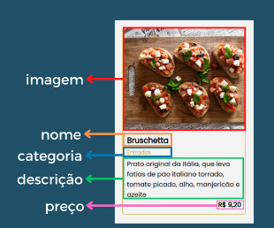
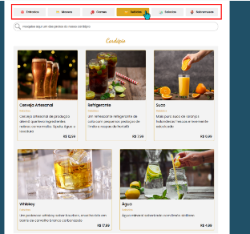
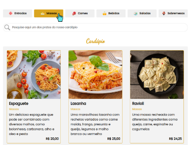
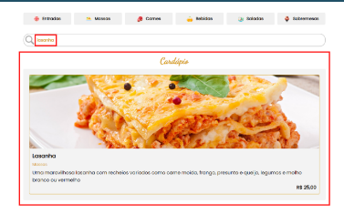

Mini Mundo - Site de cardápio de restaurante

O projeto que será criado é um site para um restaurante, onde é apresentado um cardápio com todos os pratos.

O objetivo é que os clientes consigam buscar no site qualquer prato servido pelo restaurante através do nome, categoria ou descrição do prato.

A página terá a seguinte estrutura:

Topo
Banner (imagem e conteúdo textual);
Conteúdo principal
Botões de filtro por categoria dos produtos;
Campo de busca;
Container que lista os produtos (cards).

Mini Mundo - Site de cardápio de restaurante:

O usuário poderá visualizar os pratos do cardápio através dos botões de categoria

Sempre que um botão for clicado ele deve "acender", ou seja, ele deve mudar de cor como indicação de que foi clicado pelo usuário

No input de busca, o usuário poderá digitar o nome ou a descrição do produto que será pesquisado.Para iniciar a busca o texto digitado no input deve ter três ou mais caracteres
Se o texto digitado for menor que três caracteres, ou for apagado, os produtos que já estão sendo exibidos continuarão em tela

Quando uma busca for realizada, o resultado será exibido no contêiner responsável pelo cardápio

Os dados utilizados no projeto serão estáticos e deverão estar armazenados na própria aplicação

Cada prato deve ter um id, um nome, uma categoria, um preço, uma descrição e uma imagem

exemplo:
import espaguete from "../img/espaguete.jpg";

{
  id: 1,
  nome: "Espaguete",
  categoria: "Massas",
  preco: 20.0,
  descricao: "Um delicioso espaguete que pode ser combinado com diversos molhos, como bolonhesa, carbonara, alho e óleo e pesto",
  imagem: espaguete,
}
